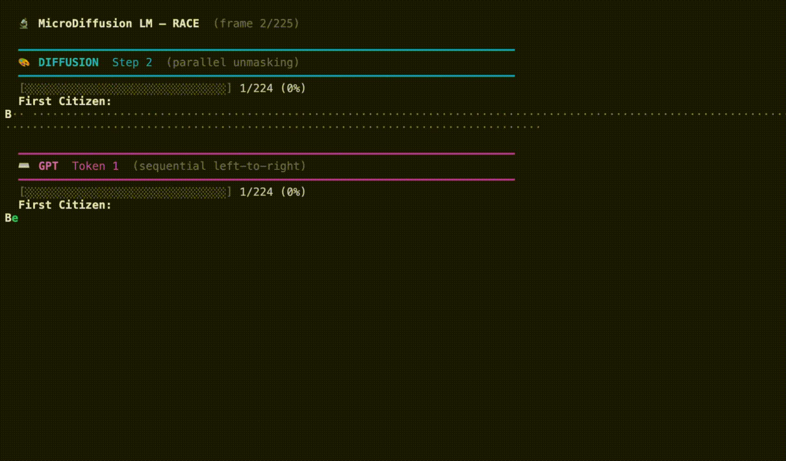

# 🔬 MicroDiffusion LM

**A from-scratch discrete diffusion language model on Tiny Shakespeare**

Built step-by-step to understand how discrete diffusion works for text generation — and how it compares to the familiar GPT (autoregressive) approach. Every line is written for clarity, not cleverness.

<p align="center">
  
  
  
  
</p>

<p align="center">
  
</p>
<p align="center">
  <em>Same architecture, same data — diffusion finishes in <strong>39 steps</strong> vs GPT's <strong>225 steps</strong></em>
</p>

---

## What is this?

Most language models generate text **left-to-right**, one token at a time (GPT, LLaMA, Claude, etc.). Discrete diffusion models generate text **all at once** — starting from a fully masked sequence and iteratively revealing tokens in parallel, like developing a photograph.

This repo builds both from scratch with an **identical architecture** (same params, same data, same transformer) so you can see exactly what changes — and it turns out to be surprisingly little:

### The 5 Changes from GPT → Diffusion

| #  | What Changes              | GPT                       | Diffusion                        |
|----|---------------------------|---------------------------|----------------------------------|
| 1  | **Vocabulary**            | Standard chars             | + 1 MASK token (`_`)             |
| 2  | **Attention**             | Causal (sees only left ←)  | Bidirectional (sees everything ↔)|
| 3  | **Training objective**    | Predict next token         | Denoise masked tokens            |
| 4  | **Loss scope**            | All positions              | Masked positions only            |
| 5  | **Generation**            | Sequential, left-to-right  | Parallel, by confidence          |

That's it. Same transformer, same RoPE, same RMSNorm, same ReluSquared MLP. **~80% of the code is shared.**

---

## How Generation Works

### Diffusion: Parallel Unmasking 🎨

```
Step  0:  ··················································  (all masked)
Step  5:  Be····d him to····with·a·························
Step 15:  Be hold him to him with a milling his············
Step 30:  Be hold him to him with a milling his cold, As he
```

The model sees the **entire** sequence at each step (bidirectional attention) and predicts all positions simultaneously. It reveals the most **confident** predictions first — common words and clear patterns emerge before ambiguous positions.

### GPT: Sequential Typing ⌨️

```
Token  0:  First Citizen:\nB
Token 10:  First Citizen:\nBefore we p
Token 20:  First Citizen:\nBefore we proceed any
Token 48:  First Citizen:\nBefore we proceed any further, hear me speak.
```

The model can only see **tokens to its left** (causal attention) and generates strictly one token at a time.

---

## Training Results

All models trained on **Tiny Shakespeare** (~1.1M characters, 65 unique + 1 MASK = 66 vocab).

| Model                    | Architecture   | Params | Train Loss | Val Loss | Iters  | Time     |
|--------------------------|----------------|--------|------------|----------|--------|----------|
| MLP Denoiser (step1)     | 2-layer FF     | 0.37M  | 3.31       | 3.31     | 5,000  | ~6 min   |
| Small Transformer (step2)| 4L / 4H / 128E | 1.6M   | 2.16       | 2.27     | 10,000 | ~7 min   |
| **Diffusion (final)**    | 6L / 6H / 384E | 10.7M  | 1.93       | 2.09     | 10,000 | ~47 min  |
| **GPT (final)**          | 6L / 6H / 384E | 10.7M  | 0.13       | 4.09     | 5,000  | ~24 min  |

### Key Observations

- **GPT overfits heavily** — train loss 0.13 but val loss 4.09 (worse than random!). It memorizes the training set with no regularization (dropout, weight decay etc. left out intentionally for simplicity).
- **Diffusion generalizes much better** — train 1.93, val 2.09. The random masking acts as a natural regularizer (each training step shows a different corruption pattern).
- **The loss numbers aren't directly comparable** — diffusion loss is only over masked positions (harder), while GPT loss is over all positions (includes easy next-character predictions).
- **The MLP → Transformer jump** (3.31 → 2.16) proves that attention is essential — the MLP processes each position independently and can only learn character frequencies.

### ⚠️ Honest Assessment: Output Quality

**GPT produces better text than diffusion at this scale.** This is expected and well-documented in the literature:

| Factor | Diffusion | GPT |
|--------|-----------|-----|
| **Training signal** | ~50% of tokens per batch (masked only) | 100% of tokens per batch |
| **Train-test gap** | Trains on corrupted input, generates from own predictions | Trains on ground-truth prefixes, generates the same way |
| **Val loss** | 2.09 | 4.09 (overfits, but memorized text is fluent) |
| **Generation** | Must get global structure right simultaneously | Each token conditioned on (mostly correct) left context |

Discrete diffusion LMs typically need **3-5× more training** to match autoregressive quality at small scale. The quality gap narrows significantly at larger scale (see [MDLM](https://arxiv.org/abs/2406.07524), [SEDD](https://arxiv.org/abs/2310.16834)).

**What diffusion demonstrates here:**
- ⚡ **~6× fewer forward passes** for generation (39 vs 225 steps)
- 🔀 Parallel decoding — tokens appear everywhere simultaneously
- 🧩 A fundamentally different approach to language modeling

The speed advantage is real. The quality gap is real. Both are worth understanding.

---

## Progressive Build (4 steps)

This project is built incrementally, where each step teaches one concept:

### Step 0: Forward Process (`step0_masking.py`)
> *"Before you build the neural net, understand the math."*

- Implements the cosine noise schedule: $\alpha(t) = \cos(\pi t / 2)$
- Each token is independently masked with probability $1 - \alpha(t)$
- Verifies: at $t=0$ nothing is masked, at $t=1$ everything is masked
- No neural network — just masking and statistics

### Step 1: MLP Denoiser (`step1_denoise_mlp.py`)
> *"Prove the training loop works with the simplest possible model."*

- Simple MLP: embedding → ReLU → ReLU → output
- Processes each position independently (no attention!)
- Learns character frequencies but **cannot use context**
- Loss: 4.19 → 3.31 (learns that 'e' and space are common, but nothing more)

### Step 2: Transformer Denoiser (`step2_transformer.py`)
> *"Replace the MLP with a transformer. See the quality jump."*

- Bidirectional self-attention (`is_causal=False`) — the key difference from GPT
- RoPE positional embeddings, RMSNorm, ReluSquared MLP
- Loss drops to ~2.16 (far below MLP ceiling) — **attention works**

### Step 3+: Sampling, Scaling, Comparison (`colab_training.ipynb`)
> *"Scale up, generate text, and compare with GPT."*

- Iterative confidence-based parallel decoding
- Scale to 6L/6H/384E (10.7M params)
- Train GPT with identical architecture for fair comparison
- SUBS parameterization: clamp MASK logit to $-\infty$ during generation

---

## Architecture

Both the diffusion and GPT models share this architecture:

```
Input tokens (B, T)
    │
    ▼
Token Embedding ──→ (B, T, 384)
    │
    ▼
RMSNorm
    │
    ▼
┌─────────────────────────────────────┐
│  Transformer Block × 6             │
│  ┌───────────────────────────────┐  │
│  │ RMSNorm                       │  │
│  │ Multi-Head Attention (6 heads)│  │  ← Bidirectional (diffusion)
│  │   + RoPE on Q, K             │  │    or Causal (GPT)
│  │   + QK-Norm for stability    │  │
│  │ Residual connection           │  │
│  ├───────────────────────────────┤  │
│  │ RMSNorm                       │  │
│  │ MLP: Linear → ReluSquared     │  │
│  │      → Linear (4× expansion) │  │
│  │ Residual connection           │  │
│  └───────────────────────────────┘  │
└─────────────────────────────────────┘
    │
    ▼
RMSNorm
    │
    ▼
Linear Head ──→ (B, T, 66)  ──→  logits over vocabulary
```

**Component choices explained:**

| Component | Choice | Why |
|-----------|--------|-----|
| Positional encoding | RoPE (Rotary) | Encodes relative position; no learned embeddings needed |
| Normalization | RMSNorm (functional) | Simpler than LayerNorm; no learnable γ, β |
| Activation | ReluSquared | Sparse like ReLU but smoother gradients; `ReLU(x)²` |
| Attention bias | No bias | Fewer params, standard in modern architectures |
| QK normalization | Yes | Prevents attention logit explosion in deep models |

---

## Repository Structure

```
microdiffusion/
├── README.md                  ← You are here
├── step0_masking.py           ← Forward process only (no neural net)
├── step1_denoise_mlp.py       ← MLP denoiser (proves training loop)
├── step2_transformer.py       ← Bidirectional transformer (quality jump)
├── colab_training.ipynb       ← Full training: scale up + GPT comparison
├── visualize.py               ← Terminal animation: diffusion vs GPT
├── data/
│   └── shakespeare.txt        ← Tiny Shakespeare (~1.1MB)
├── weights/
│   ├── diffusion.pt           ← Trained diffusion model (41 MB)
│   ├── gpt.pt                 ← Trained GPT model (41 MB)
│   └── training_log.json      ← All training curves
└── blog/
    └── post.md                ← Walkthrough blog post
```

---

## Quick Start

### 1. Clone & Setup

```bash
git clone https://github.com/YOUR_USERNAME/microDLM.git
cd microDLM

# Python 3.10+ required. Install PyTorch:
pip install torch
```

### 2. Download Data

```bash
mkdir -p data
wget -O data/shakespeare.txt \
  https://raw.githubusercontent.com/karpathy/char-rnn/master/data/tinyshakespeare/input.txt
```

### 3. Run the Steps Locally

```bash
# Step 0: Understand the forward process (no GPU needed)
python step0_masking.py

# Step 1: Train MLP denoiser (~6 min on CPU/MPS)
python step1_denoise_mlp.py

# Step 2: Train small transformer (~7 min on MPS, ~2 min on GPU)
python step2_transformer.py
```

### 4. Train Final Models (GPU recommended)

Upload `colab_training.ipynb` to Google Colab (Runtime → GPU) and run all cells. Training takes ~70 minutes total on a T4. Download the weights to `weights/`.

### 5. Visualize

```bash
# Animated race — diffusion finishes ~6× faster than GPT!
python visualize.py

# Static snapshots (no animation)
python visualize.py --no-animate

# Only diffusion, longer output
python visualize.py --diffusion-only --length 500

# Slower animation to study the process
python visualize.py --delay 0.05
```

---

## How Diffusion Generation Works (step by step)

The iterative parallel decoding algorithm uses a **cosine schedule** over T steps
(default T = 40). Each step unmasks a batch of tokens — most confident first:

```
1. Start with: [prompt tokens] + [MASK MASK MASK ... MASK]
   (224 masked tokens for a 240-length sequence with 16-char prompt)

2. Cosine schedule determines how many tokens to unmask per step:
   n_masked(t) = N × cos(π/2 × t/T)²
   Early steps unmask few tokens, middle steps unmask many

3. At each step:
   a. Feed the entire sequence through the bidirectional transformer
      → get logits for ALL positions simultaneously
   b. Apply SUBS: set logits[MASK_token] = -∞
   c. Compute confidence = top-1 probability at each masked position
   d. Unmask the k most-confident positions (k from schedule)
   e. Sample actual characters from top-k distributions

4. Repeat from step 3 until no MASK tokens remain (~40 steps total)

5. For longer text: slide to next block, using generated text as context
```

This resolves a 240-token block in **~40 forward passes** (vs. 224 for GPT), because multiple tokens are decoded in parallel each step. Highly confident positions (spaces, common letters) are revealed first.

---

## The Math

### Forward Process (Noising)

Given clean text $\mathbf{x}_0$, the forward process produces noisy text $\mathbf{x}_t$ by independently masking each token:

$$P(\mathbf{x}_t^i = \texttt{MASK} \mid \mathbf{x}_0^i) = 1 - \alpha(t)$$

where $\alpha(t) = \cos(\pi t / 2)$ is the cosine schedule.

- At $t=0$: $\alpha = 1$, all tokens kept (clean text)
- At $t=1$: $\alpha = 0$, all tokens masked (pure noise)

### Training Objective

The model $p_\theta$ is trained to predict the original tokens at masked positions:

$$\mathcal{L} = \mathbb{E}_{t, \mathbf{x}_0}\left[\sum_{i \in \text{masked}} -\log p_\theta(\mathbf{x}_0^i \mid \mathbf{x}_t)\right]$$

Key insight: the loss is computed **only at masked positions**. Unmasked tokens provide context for free.

### SUBS Parameterization

During generation, we clamp $\text{logits}[\texttt{MASK}] = -\infty$ so the model never outputs the MASK token. This is the **SUBS** (substitution) parameterization from the discrete diffusion literature — the model always predicts real tokens, never "I don't know."

---

## Inspiration & References

- [nathan-barry/tiny-diffusion](https://github.com/nathan-barry/tiny-diffusion) — The reference implementation this project takes heavy inspiration from. Demonstrates that GPT and diffusion LMs are 80% the same code with 5 key changes.
- [Andrej Karpathy's nanoGPT](https://github.com/karpathy/nanoGPT) — The educational GPT implementation that inspired the coding style and progressive build approach.
- [MDLM: Masked Diffusion Language Models](https://arxiv.org/abs/2406.07524) (Sahoo et al., 2024) — The paper establishing the SUBS parameterization and showing masked diffusion can match autoregressive models at scale.
- [Score Entropy Discrete Diffusion](https://arxiv.org/abs/2310.16834) (Lou et al., 2024) — Theoretical foundations for discrete diffusion with concrete score matching.

---

## What I Learned

1. **Diffusion LMs are surprisingly simple.** If you understand GPT, you understand 80% of diffusion. The remaining 20% is: bidirectional attention, masking, and parallel decoding.

2. **Masking is a natural regularizer.** The diffusion model sees a different corruption pattern every training step, which prevents overfitting. Our GPT memorized the training set (val loss 4.09!), while diffusion generalized well (val loss 2.09).

3. **The MLP → Transformer jump is dramatic.** Without attention, the model can only learn "space is the most common character." With attention, it learns words, names, and sentence structure.

4. **Parallel generation is real.** The diffusion model resolves 240 tokens in ~40 steps (averaging ~6 tokens per step). High-confidence positions (spaces, common patterns) are revealed first.

5. **Loss numbers aren't directly comparable.** Diffusion loss is over masked tokens only (harder predictions), while GPT loss is over all tokens. A diffusion val loss of 2.09 doesn't mean it's "worse" than a GPT val loss of 1.55 — they're measuring different things.

---

## License

MIT. Built for learning.
