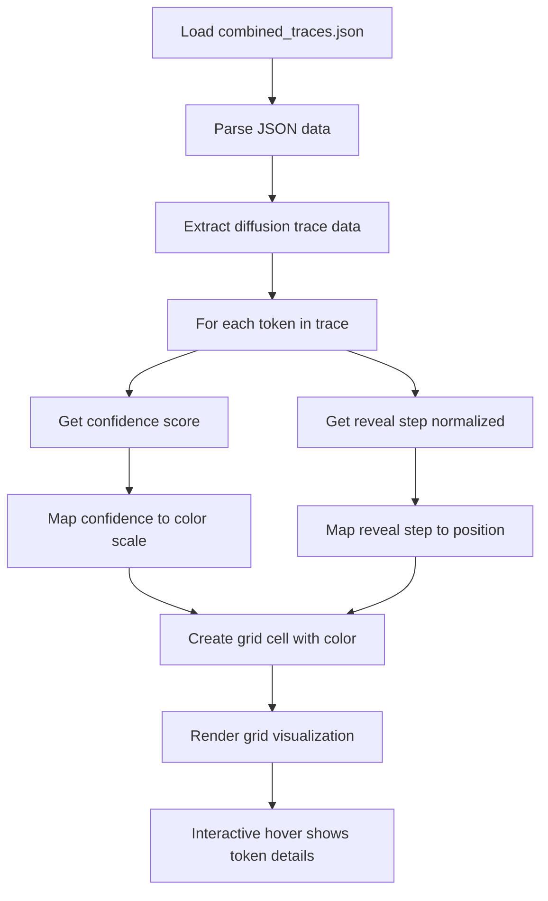
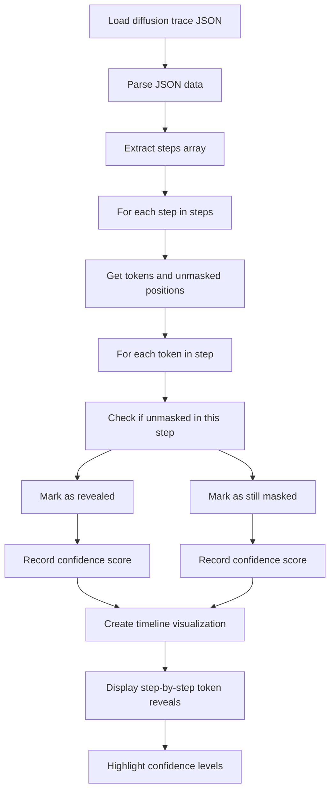
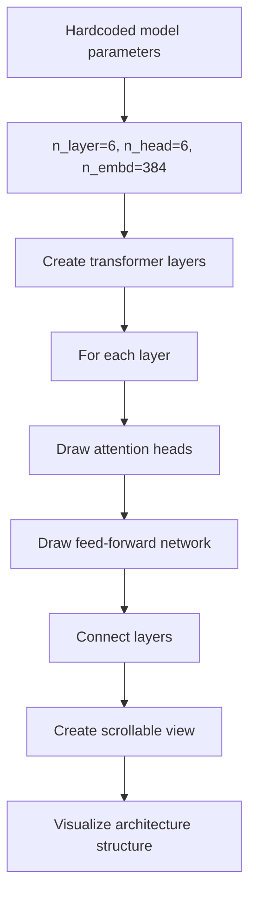
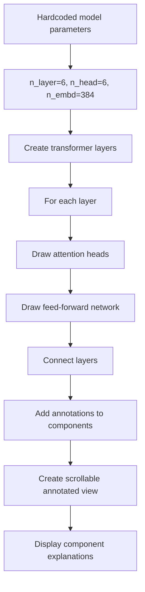

# Visualization v2 Flowcharts

This document explains how each visualization in `visualizations_v2` works, including inputs, processing, and outputs. All visualizations use real data from the trained diffusion and GPT models.

## 1. Confidence Grid Visualization

### Input Process
- Loads `combined_traces.json` generated by `generate_traces.py`
- Parses the JSON to extract diffusion trace data
- Processes each token's `confidence` and `reveal_step_normalized` values

### Key Processing Steps
- Creates a grid where:
  - Rows = token positions
  - Columns = diffusion steps
- Colors cells based on confidence (high confidence = green, low = red)
- Shows reveal timing through position in the grid

### Output
- Interactive grid visualization showing:
  - Which tokens were revealed when
  - Confidence levels at reveal time
  - Token content on hover

## 2. Inference Flow Visualization

### Input Process
- Loads diffusion trace JSON from `generate_traces.py`
- Parses the `trace.steps` array which contains step-by-step unmasking data

### Key Processing Steps
- Processes each step's `tokens` and `unmasked_this_step` data
- Tracks which tokens were revealed at each step
- Calculates confidence scores for revealed tokens

### Output
- Timeline visualization showing:
  - How tokens are revealed over diffusion steps
  - Confidence scores for each revealed token
  - Masked tokens as grayed-out placeholders

## 3. Architecture Scroll Visualization

### Input Process
- Uses hardcoded parameters matching `step2_transformer.py` configuration
- `n_layer=6`, `n_head=6`, `n_embd=384`

### Key Processing Steps
- Renders the transformer architecture structure
- Draws each layer with attention heads and feed-forward networks
- Connects layers to show data flow

### Output
- Scrollable visualization of transformer architecture
- Shows:
  - Layer structure (6 layers total)
  - Multi-head attention (6 heads per layer)
  - Feed-forward network components

## 4. Architecture Scroll Annotated Visualization

### Input Process
- Same hardcoded parameters as Architecture Scroll

### Key Processing Steps
- Renders the transformer architecture structure
- Adds explanatory annotations to each component
- Labels attention heads, feed-forward networks, and layer connections

### Output
- Scrollable annotated visualization of transformer architecture
- Shows:
  - Component names and functions
  - Data flow between components
  - Parameter counts for each section